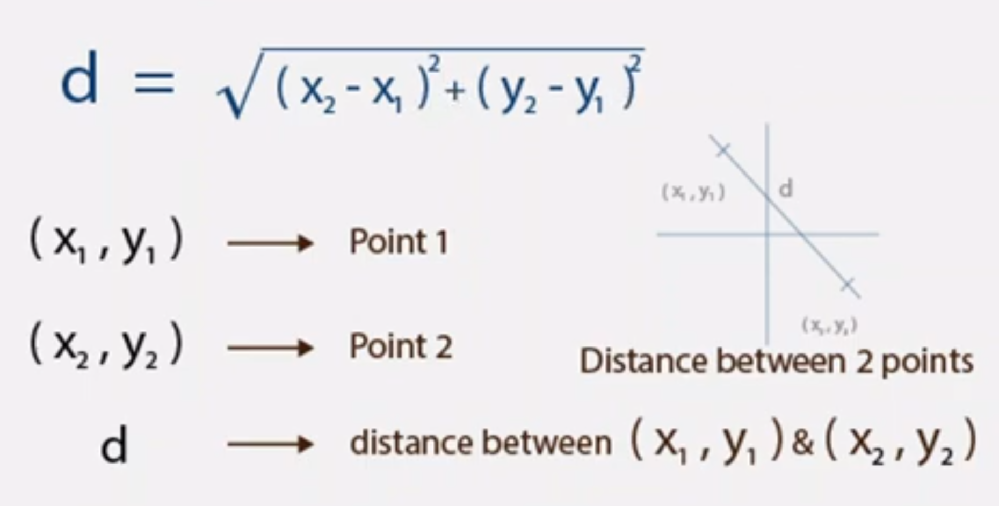

# Bullets And Shooting
### Creating The Bullet
We create the bullet image the same way we created the player and the enemy images, using the `pygame.image.load()` function to load the image to the code and the `screen.blit()` function to draw the image to the screen. Remember to use the filename of the bullet image in the `.image.load()` function.

For the position, we would also declare the variables of both the x and y co-ordinates

```python
bulletimg = pygame.image.load("bullet.png")
#...
bulletX=386
bulletY=489
#....
screen.blit(bulletimg, (bulletX, bulletY))
```

We're using the bullet position 386 and 489 to make the bullet seem like it's coming from the player or the ship.

### Shooting The Bullet
To shoot the bullet, we first need to show the bullet only if a particular key is pressed, the spacebar. To do that, the `.blit()` method would be called within the if-statement for the space bar. To prevent that, there are two methods, we can move the bullet blit method to be inside of the if-statement for the space-bar key. Let's try that, inside the if-statement for the key down, type the following:

```python
if event.key == pygame.K_SPACE:
	screen.blit(bulletimg, (bulletX, bulletY))
```

When we add this to the code and run, it doesn't work too well and the bullet image doesn't stay, but it flickers. To fix this, we use the second method.

We create a boolean to check if the bullet has already been drawn, if it's not, we draw it. That way, we can call screen.blit() for the bullet at it's original position in the code. 
First create a boolean called, bulletShow. Then in the event.key if statement for the spacebar, we check is the bullet is showing, if it's not we change the value of bulletShow to true. To draw the bullet on the screen, we go to where the screen.blit() for the bullet is and condition it so that it only darws when bulletShow is true:

```python
bulletShow = False
#...
if event.key == pygame.K_SPACE:
	if bulletShow is False:
		bulletShow = True

#...
if bulletShow is True:
	screen.blit(bulletimg, (bulletX, bulletY))
```

Now run the code. It works! Now the fun part, to shoot it.

To shoot the bullet, when the spacebar is pressed down, the bullet should move positions upward i.e in the y-axis. We can do that by adding -1 to the bulletY position when the spacebar has been pressed. But instead of doing that in the spacebar if-statement, we'll do that in the if-statement for drawing the bullet. 

>Remember that the Y-axis in pygame starts from the top to the bottom, 0 to end of screen

```python
if bulletShow is True:
	screen.blit(bulletimg, (bulletX, bulletY))
	bulletY-=5
```

When the bullet reaches the 0 co-ordinate on the y-axis, it should reset to the original position on the bullet. We do this by having another if statement above the bullet blit method.

```python
if bulletY<=0:
	bulletY=490
```

That would make it go back to it's position on the player. Remember if the player is moving on the x-axis, the bullets x-position would still be the same and won't be on the player/ship. This would be fixed soon.

When you run the code, the bullet keeps moving and respawining, even if you have stopped pressing the spacebar. To fix this, we change `bulletShow` to be `False`.

```python
if bulletY<=0:
	bulletY=490
	bulletShow = False
```

If you have been moving your player on the x-axis, you'll notice that the bullet doesn't follow your player around, to fix that, we equate the x-position of the bullet to that of the players. We do this in the key event for the spacebar. If we do this, the bullet will respwan at the ship/player x-co-ordinate, though it'll be blocked by the player sprite. To fix this, we add 16 to bulletX, this is because the distance between the x-position of the player and the x-position of the bullet is 16.

```python
if event.key == pygame.K_SPACE:
	if bulletShow is False:
		bulletShow = True
		bulletX = playerX + 16
```

#### CODE RECAP 5
```python
import pygame
import random

pygame.init()

screen = pygame.display.set_mode((800, 600))
background = pygame.image.load('bg.png')
playerimg = pygame.image.load('arcade.png')
enemyimg = pygame.image.load('enemy.png')
bulletimg = pygame.image.load("bullet.png")

playerX = 370
playerY = 480

bulletX=386
bulletY=489

enemyX=random.randint(0, 736)
enemyY=random.randint(30, 150)
enemyspeedX=1
enemyspeedY=40

bulletShow = False

running = True
while running:
	screen.blit(background, (0, 0))
	for event in pygame.event.get():
		if event.type == pygame.QUIT:
			running = False
		if event.type == pygame.KEYDOWN:
			if event.key == pygame.K_LEFT:
				changeX = -5
			if event.key == pygame.K_RIGHT:
				changex = 5
			if event.key == pygame.K_SPACE:
				if bulletShow is False:
					bulletShow = True
					bulletX = playerX+16
		if event.type == pygame.KEYUP:
			changex = 0
	playerX += changeX
	if playerX<=0:
		playerX=0
	elif playerX>=736:
		playerX=736

	enemyX+=enemyspeedX
	if enemyX<=0:
		enemyspeedX=1
		enemY+=40
	if enemyY>=736:
		enemyspeedX=-1
		enemyY+=enemyspeed

	screen.blit(playerimg, (playerX, playerY))
	
	if bulletY<=0:
		bulletY=490
		bulletShow=False
	if bulletShow is True:
		screen.blit(bulletimg, (bulletX, bulletY))
		bulletY-=5

	screen.blit(enemyimg, (enemyX, enemyY))
	pygame.display.update()
```

### Destroying The Enemy
It's time to DESTROY the enemy. When the bullet collides with the enemy, the enemy should be destroyed. To do that, we need to know the distance between them. We're going to use the formula used commonly in math to find the distance between two co-ordinates




To use this formula, we must first import math to the code by using `import math` . This will help us to use square root and square easily. The result will be svaed into a variable called distance. Write this code before the rest of the `bulletY<=0` line.

```python
distance = math.sqrt(math.pow((bulletX-enemY),2) + math.pow((bulletY-enemyY),2)
```

To check whether or not the bullet has collided with the enemy, we use an if statement.

```python
if distance<27:
	bulletY=489
	bulletShow = False
	enemyX=random.randint(0, 736)
	enemyY=random.randint(30, 150)
```

The code above shows that, when the distance between the bullet and the enemy is 27 (you can use any number asides 27, this was what worked for me), 
1. reset the bulletY position back to it's original position
2. Bullet should not be shown
3. Regenerate a random position for the enemy to spawn in
