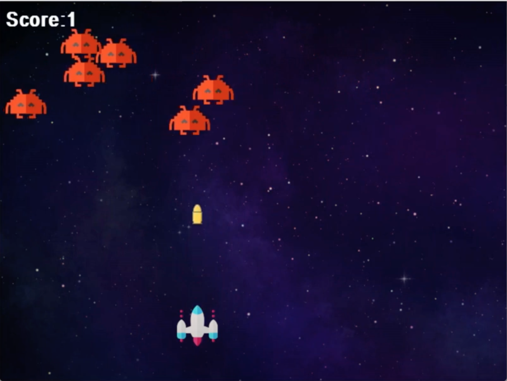

# Finishing Touches
### Sound Effects
This is optional, so if you're proud of your game, there is no need to do this.
To add sound to your game, there is a module in the pygame library called mixer used for sound effects. To acces mixer you import it and initialize it.

```python
from pygame import mixer
mixer.init()
```

To use music with mixer, the music files should be in the same directory or folder as your code.
The following are places where sound effects would be needed:

1. Background
	The Background would have music continuously playing until the game ends. To accomplish this, you load it in, as you do for an image, using the filename of the music and then play it.
	
	```python
	mixer.music.load("background.wav")
	music.mixer.play(-1)
	```

	It's `-1` because we want the music to play continuously.

2. Player Shoots
	There should be a sound effect when the bullet is hot by the player. The player shoots when the spacebar is pressed. We should then play the sound effect when the space bar is pressed.
	
	```python
	if event.key == pygame.K_SPACE:
		bulletSound = mixer.Sound("laser.wav")
		bulletSound.play()
		if bulletShow is False:
			bulletShow = True
			bulletX = playerX+16
	```

	We're using `mixer.Sound` because we don't want the sound/music to interrupt other music or sounds that will be played.

3. Enemy Destroyed
	When the enemy is destroyed, we want to play an explosion sound. To do that we use the `if distance < 27` statement.
	```python
	if distance<27:
		explosion = mixer.Sound("explosion.wav")
		explosion.play( )
		bulletY=489
		bulletShow = False
		enemyX[i]=random.randint(0, 736)
		enemyY[i]=random.randint(30, 150)
		score+=1
	```


# CONCLUSION
Your code and game should now look like this:

```python
import pygame
import random
import math
import mixer

pygame.init()

screen = pygame.display.set_mode((800, 600))
background = pygame.image.load('bg.png')
playerimg = pygame.image.load('arcade.png')
enemyimg = pygame.image.load('enemy.png')
bulletimg = pygame.image.load("bullet.png")

playerX = 370
playerY = 480

bulletX=386
bulletY=489
bulletShow = False

enemyX=random.randint(0, 736)
enemyY=random.randint(30, 150)
enemyspeedX=-1
enemyspeedY=40

font = pygame.font.SysFont('Arial', 32, 'bold')
def scoreShow():
	img = font.render(f"Score: {score}", True, "white")
	screen.blit(img, (10,10))

font_gameover = pygame.font.SysFont('Arial', 64, 'bold')
def gameover():
    img_gameover = font_gameover.render('GAME OVER', True, 'white')
    screen.blit(img_gameover, (200, 250))

running = True
while running:
	screen.blit(background, (0, 0))
	for event in pygame.event.get():
		if event.type == pygame.QUIT:
			running = False
		if event.type == pygame.KEYDOWN:
			if event.key == pygame.K_LEFT:
				changeX = -5
			if event.key == pygame.K_RIGHT:
				changex = 5
			if event.key == pygame.K_SPACE:
				bulletSound = mixer.Sound("laser.wav")
				bulletSound.play()
				if bulletShow is False:
					bulletShow = True
					bulletX = playerX+16
		if event.type == pygame.KEYUP:
			changex = 0
			
	playerX += changeX
	if playerX<=0:
		playerX=0
	elif playerX>=736:
		playerX=736
		
	for i in range(no_of_enemies):
		if enemyY[i] == playerY-50:
			for j in range(no_of_enemies):
				enemyY[i] = 2000
				gameover()
		enemyX[i]+=enemyspeedX[i]
		if enemyX[i]<=0:
			enemyspeedX[i]=1
			enemY[i]+=40
		if enemyY[i]>=736:
			enemyspeedX[i]=-1
			enemyY[i]+=enemyspeed[i]
		distance = math.sqrt(math.pow((bulletX-enemY),2) + math.pow((bulletY[i]-enemyY[i]),2)
		if distance<27:
			explosion = mixer.Sound("explosion.wav")
			explosion.play( )
			bulletY=489
			bulletShow = False
			enemyX[i]=random.randint(0, 736)
			enemyY[i]=random.randint(30, 150)
			score+=1
		screen.blit(enemyimg[i], (enemyX[i], enemyY[i]))
		
	screen.blit(playerimg, (playerX, playerY))
	
	if bulletY<=0:
		bulletY=490
		bulletShow=False
	if bulletShow is True:
		screen.blit(bulletimg, (bulletX, bulletY))
		bulletY-=5
	scoreShow()
	pygame.display.update()
```




Feel free to change it however you like. Good luck out there young gamer.