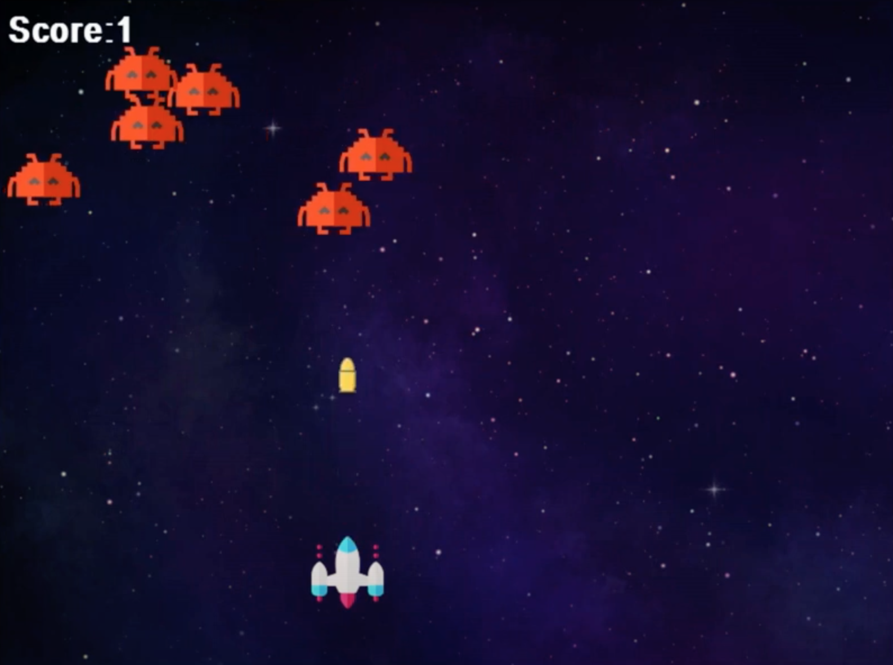

# Introduction
This game would cover the last few aspects of pygame. That is music, sprites and other game mechanics. The game would be a simple space shooting game or an older version of space invaders.
By the end of this course, you should be able to create and personalize a shooting game in pygame That looks like this.



### Screen Settings
First import pygame and do the necessary things to get pygame going.
Set screen to 800x600.
You can set your screen title using `pygame.display.set_caption('Space Shooter Game')`. This will set your pygame caption to be 'Space Shooter Game'
# **Initializing The Screen**

Create a bool variable which would control whether or not the game is running and call it `running` , then equate it to the bool value `true`.
  
Create a while loop which will only run when `running = true` . This means that the program/game would run only when the running bool is ‘true’.

Most of the code to control the functions of the game would be placed in this loop as they can only run/work while the game is ‘running’.

Now, inside the while loop (that is controlling the game screen), a for loop will be placed

```python
running = True

while running:
	for event in pygame.event.get():
		if event.type == pygame.QUIT:
			running = False

```

The first line of the code loops through each event in pygame, collects the events in `pygame.event.get()`  such as a particular key being pressed, your mouse clicking on an object or if your game is quit. These are all events that users of the game do/initiate.

The next line checks for the event in which the game is ‘quit’ or closed, if it is, the bool ‘running’ is set to false which makes the while loop stop running, and the game closes.

Now if your run the game, if you click the cross/close button on the right side of your screen, the game stops

### **Adding Background Image**

Your game looks a little black and boring, so let’s add a background. You can click the link or search online for a nice space background. Download the image and add it to the **folder** where your code is. This makes it easier to reference it in your code. Name the image file whatever you want, but remember it as we are going to use it in the code

Before the loop, we’re going to load the image into our code by using `pygame.image.load()` in the brackets, write the name of the file that you saved that has the background image you want to use, also include the extension(.png, .jpg). The filename and extension should be closed in quotation marks. Create a variable and name it what you want, but preferably background, and equate the  `pygame.image.load()` function to it. It should look like this:

```python
background = pygame.image.load('bg.png')`
```
  

The `image.load()` function is used to load, initialize or reference any image saved that you want to use in your code.

The image has only been loaded to your code, but it’s not yet set as your game background. To do that, go into your while loop and write the function `pygame.blit()`. This function is used to draw images to your screen. It takes two parameters, the image you want to draw (which we have saved in the code as background) and where you want to start drawing it. Because it’s the background image, we start drawing from the top and left co-ordinates, which is (0,0).

```python
pygame.blit(background, (0,0))
```

To now ensure the background is changed, we us the method ‘pygame.display.update()’. It updates the display of the game so that the image is drawn. This code is written in the while loop as it’s a constant part of the game. It’s also written after the for loop as it’s not a user/gamer initiated event.

```python
pygame.update.display()
```
Run the game now to see the background