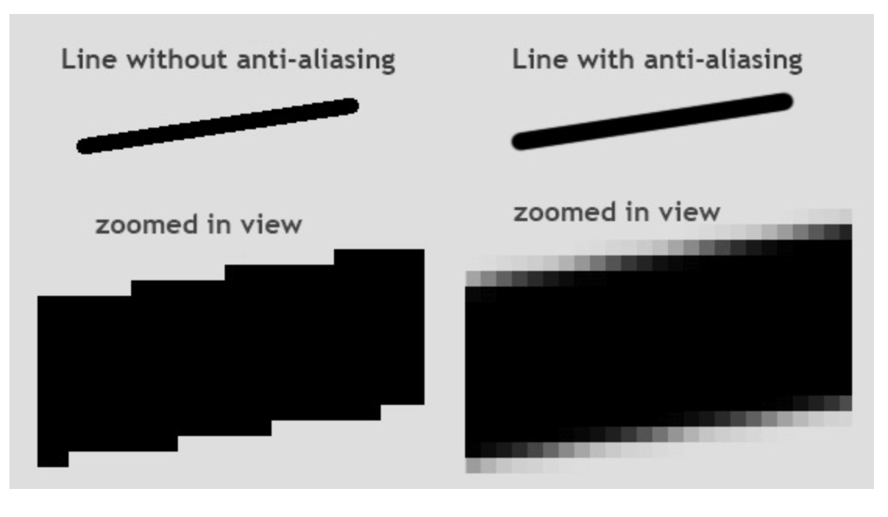

# Scoring And Gameover
### Scoring
We want to show the score on the screen everytime the bullet collides with the enemy image and destroys it. We also want to display the score on the screen. But first, let's change the score. Declare the variable `score` and equate it to 0.

We want to increment the score variable everytime the bullet collides with the enemy image.
```python
if distance<27:
	bulletY=489
	bulletShow = False
	enemyX=random.randint(0, 736)
	enemyY=random.randint(30, 150)
	score+=1
```

Now, anytime we shoot and it hits the enemy, the score increases. But we can't see it.
To see the score text on the screen, we use the `.font()` method to create a font that the score would be shown in.
```python
font = pygame.font.SysFont('Arial', 32, 'bold')
```

'Arial' is the name of the font, '32' is the size of the font and 'bold' shows whether or not the Font is bold.
We then create a function to print the score on the screen using another function.

```python
def scoreShow():
	img = font.render(f"Score: {score}", True, "white")
	screen.blit(img, (10,10))
```

The `.render()` function takes in 3 parameters, the first being what it prints out, the third being the text color and the second is anti-aliasing.
Anti-aliasing is the smoothness of the image.



As you can tell, anti-aliasing makes the lines smoother by blurring the edges, so the overall image doesn't look jagged.
And then everything is saved as an image in the `img` variable.
 Then we use the normal `.blit()` method to draw th score image on the screen.
 You can then call the score below with the rest of the `.blit()` functions.
```python
screen.blit(playerimg, (playerX, playerY))
screen.blit(enemyimg, (enemyX, enemyY))
scoreShow()
```

Now run the code. You will now see that Score shows on your screen

### GameOver
The game is over, not when the enemy hits the player, but when the enemy enters the same y-axis as the player. This is to keep the game simpler.
To do this is quite simple. Create a condition in the while loop where if the enemy y-position is equal to a particular y-position, the enemy disappears. This y position is the position is where the player is.

Add this if-statement in the while loop:

```python
if enemyY == playerY-50:
	enemyY = 2000
```

The offset of 50 from the players y-position is to ensure that the enemy doesn't move on top of the player.
The enemy's y-position is changed to 2000 because the screen is not that larged which makes the enemy disappear. You can use any number as long as it's not within the height of your screen.

You can run the code now to see how it works.

Good. We now need to print out a huge "GAME OVER" sign in front of the screen when the game is... over.

To this, we replicate what we did for the score_text but with modifications.

```python
font_gameover = pygame.font.SysFont('Arial', 64, 'bold')
def gameover():
    img_gameover = font_gameover.render('GAME OVER', True, 'white')
    screen.blit(img_gameover, (200, 250))
```

Let me break this down line by line
1. We create another font, but with a larger size
2. We create a function called `gameover()`
3. We created an image to show "GAMEOVER" in white on our screens
4. Then we drew the image on the screen at the co-ordinates (200,250)

This function will be called when the game is over
```python
if enemyY == playerY-50:
	enemyY = 2000
	gameover()
```

You can now run your game and it will show the "GAMEOVER" font when the game is lost.

#### CODE RECAP 6
```python
import pygame
import random

pygame.init()

screen = pygame.display.set_mode((800, 600))
background = pygame.image.load('bg.png')
playerimg = pygame.image.load('arcade.png')
enemyimg = pygame.image.load('enemy.png')
bulletimg = pygame.image.load("bullet.png")

playerX = 370
playerY = 480

bulletX=386
bulletY=489
bulletShow = False

enemyX=random.randint(0, 736)
enemyY=random.randint(30, 150)
enemyspeedX=-1
enemyspeedY=40

font = pygame.font.SysFont('Arial', 32, 'bold')
def scoreShow():
	img = font.render(f"Score: {score}", True, "white")
	screen.blit(img, (10,10))

font_gameover = pygame.font.SysFont('Arial', 64, 'bold')
def gameover():
    img_gameover = font_gameover.render('GAME OVER', True, 'white')
    screen.blit(img_gameover, (200, 250))

running = True
while running:
	screen.blit(background, (0, 0))
	for event in pygame.event.get():
		if event.type == pygame.QUIT:
			running = False
		if event.type == pygame.KEYDOWN:
			if event.key == pygame.K_LEFT:
				changeX = -5
			if event.key == pygame.K_RIGHT:
				changex = 5
			if event.key == pygame.K_SPACE:
				if bulletShow is False:
					bulletShow = True
					bulletX = playerX+16
		if event.type == pygame.KEYUP:
			changex = 0
	playerX += changeX
	if playerX<=0:
		playerX=0
	elif playerX>=736:
		playerX=736

	enemyX+=enemyspeedX
	if enemyX<=0:
		enemyspeedX=1
		enemY+=40
	if enemyY>=736:
		enemyspeedX=-1
		enemyY+=enemyspeed
	distance=math.sqrt(math.pow((bulletX-enemY),2) + math.pow((bulletY-enemyY),2)
	if distance<27:
		bulletY=489
		bulletShow = False
		enemyX=random.randint(0, 736)
		enemyY=random.randint(30, 150)
		score+=1
	
	if enemyY == playerY-50:
		enemyY = 2000
		gameover()

	screen.blit(playerimg, (playerX, playerY))
	
	if bulletY<=0:
		bulletY=490
		bulletShow=False
	if bulletShow is True:
		screen.blit(bulletimg, (bulletX, bulletY))
		bulletY-=5

	screen.blit(enemyimg, (enemyX, enemyY))
	scoreShow()
	pygame.display.update()
```


